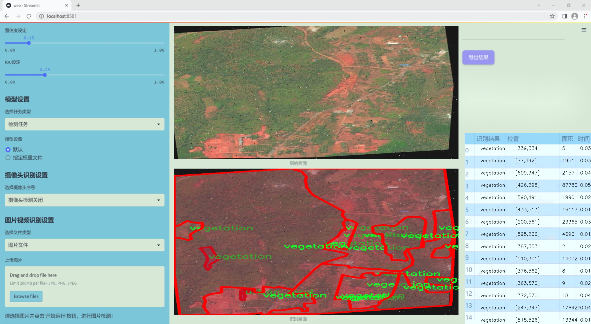
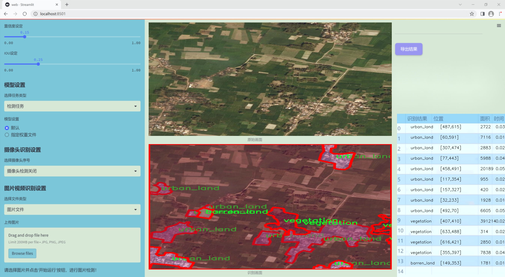
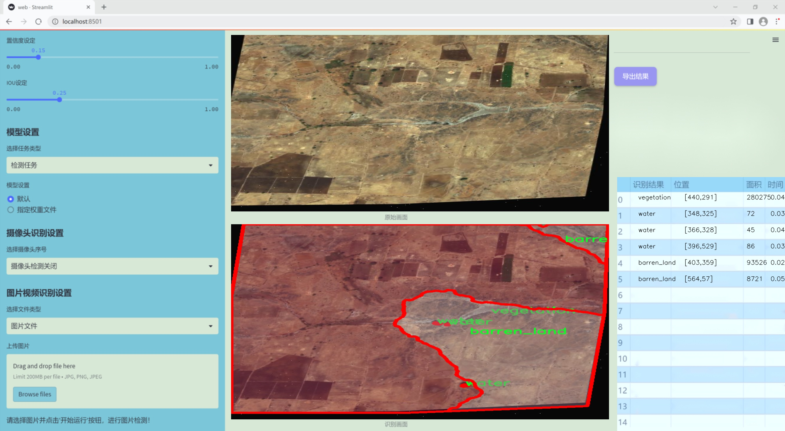
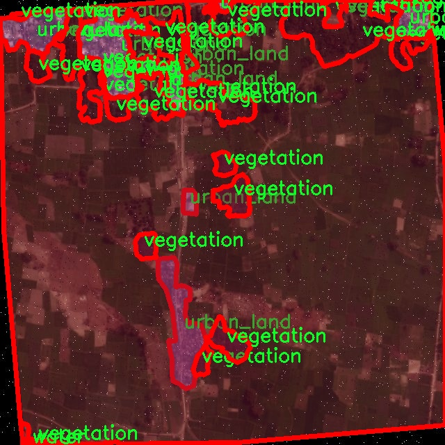
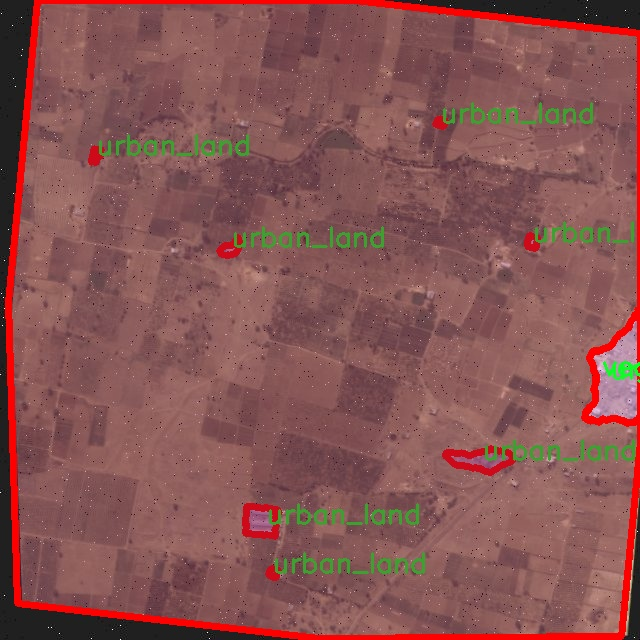
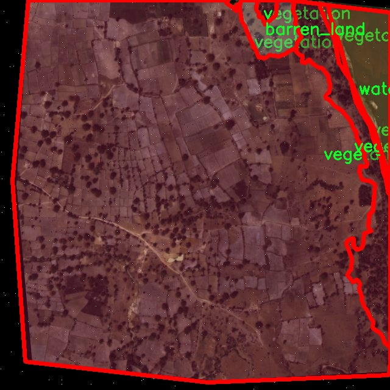
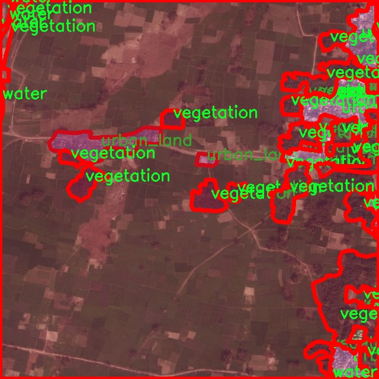
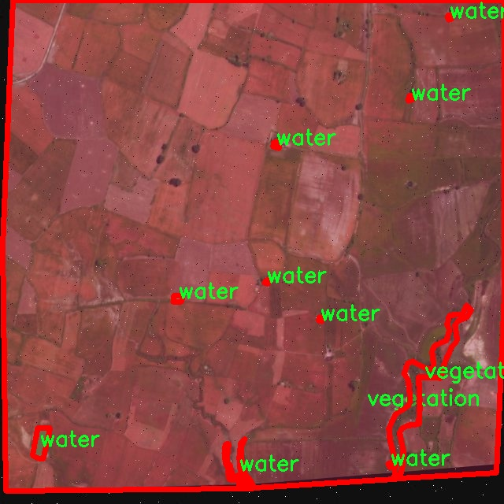

### 1.背景意义

研究背景与意义

随着全球城市化进程的加快和人类活动对自然环境的影响日益加剧，土地覆盖类型的监测与识别显得尤为重要。土地覆盖类型不仅影响生态系统的健康与稳定，还直接关系到资源管理、环境保护和可持续发展等多个领域。因此，开发高效、准确的遥感土地覆盖类型识别系统具有重要的理论和实践意义。

遥感技术的快速发展为土地覆盖类型的识别提供了新的机遇。传统的土地覆盖分类方法多依赖于人工经验和地面调查，效率低下且容易受到主观因素的影响。近年来，深度学习特别是卷积神经网络（CNN）的兴起，使得自动化的图像识别技术得到了广泛应用。在此背景下，基于改进YOLOv11的遥感土地覆盖类型识别系统应运而生，利用其强大的实时检测能力和高精度特性，能够有效提升土地覆盖分类的准确性和效率。

本研究所使用的数据集包含5800幅图像，涵盖了背景、荒地、未知、城市用地、植被和水体等六种土地覆盖类型。这些数据经过精心的预处理和增强，确保了模型训练的多样性和鲁棒性。通过对不同类型土地覆盖的准确识别，能够为城市规划、生态监测和环境管理提供科学依据，促进资源的合理利用和环境的可持续发展。

综上所述，基于改进YOLOv11的遥感土地覆盖类型识别系统不仅是技术创新的体现，更是应对全球环境变化和实现可持续发展的重要工具。通过本研究，期望能够为土地覆盖监测领域提供新的思路和方法，推动相关研究的深入发展。

### 2.视频效果

[2.1 视频效果](https://www.bilibili.com/video/BV1ZJkEYcEXG/)

### 3.图片效果







##### [项目涉及的源码数据来源链接](https://kdocs.cn/l/cszuIiCKVNis)**

注意：本项目提供训练的数据集和训练教程,由于版本持续更新,暂不提供权重文件（best.pt）,请按照6.训练教程进行训练后实现上图演示的效果。

### 4.数据集信息

##### 4.1 本项目数据集类别数＆类别名

nc: 6
names: ['background', 'barren_land', 'unknown', 'urban_land', 'vegetation', 'water']


该项目为【图像分割】数据集，请在【训练教程和Web端加载模型教程（第三步）】这一步的时候按照【图像分割】部分的教程来训练

##### 4.2 本项目数据集信息介绍

本项目数据集信息介绍

本项目旨在改进YOLOv11模型，以实现高效的遥感土地覆盖类型识别系统。为此，我们构建了一个专门的数据集，聚焦于“土地覆盖”这一主题。该数据集包含六个主要类别，分别为背景、荒地、未知、城市用地、植被和水体。这些类别的选择反映了遥感影像分析中常见的土地覆盖类型，能够为模型提供丰富的训练样本，从而提高其识别精度和泛化能力。

在数据集的构建过程中，我们充分考虑了各类土地覆盖的特征和分布，确保数据的多样性和代表性。背景类别主要用于区分非目标区域，荒地类别则涵盖了自然环境中未被开发的区域，城市用地类别则反映了城市化进程中的人类活动影响。植被类别则代表了自然生态系统中的植物覆盖，而水体类别则是水域的识别，能够帮助模型在不同环境条件下进行准确判断。未知类别的设置则为模型提供了处理不确定性和异常情况的能力。

数据集中的样本来源于多种遥感影像，包括卫星图像和航空摄影，确保了数据的时效性和多样性。每个类别的样本均经过精心标注，以保证数据的准确性和可靠性。通过这种方式，我们希望训练出的YOLOv11模型能够在实际应用中实现高效的土地覆盖识别，推动遥感技术在环境监测、城市规划和资源管理等领域的应用。整体而言，本项目的数据集不仅为模型训练提供了坚实的基础，也为后续的研究和应用奠定了良好的数据支持。











### 5.全套项目环境部署视频教程（零基础手把手教学）

[5.1 所需软件PyCharm和Anaconda安装教程（第一步）](https://www.bilibili.com/video/BV1BoC1YCEKi/?spm_id_from=333.999.0.0&vd_source=bc9aec86d164b67a7004b996143742dc)


[5.2 安装Python虚拟环境创建和依赖库安装视频教程（第二步）](https://www.bilibili.com/video/BV1ZoC1YCEBw?spm_id_from=333.788.videopod.sections&vd_source=bc9aec86d164b67a7004b996143742dc)

### 6.改进YOLOv11训练教程和Web_UI前端加载模型教程（零基础手把手教学）

[6.1 改进YOLOv11训练教程和Web_UI前端加载模型教程（第三步）](https://www.bilibili.com/video/BV1BoC1YCEhR?spm_id_from=333.788.videopod.sections&vd_source=bc9aec86d164b67a7004b996143742dc)


按照上面的训练视频教程链接加载项目提供的数据集，运行train.py即可开始训练



     Epoch   gpu_mem       box       obj       cls    labels  img_size
     1/200     20.8G   0.01576   0.01955  0.007536        22      1280: 100%|██████████| 849/849 [14:42<00:00,  1.04s/it]
               Class     Images     Labels          P          R     mAP@.5 mAP@.5:.95: 100%|██████████| 213/213 [01:14<00:00,  2.87it/s]
                 all       3395      17314      0.994      0.957      0.0957      0.0843

     Epoch   gpu_mem       box       obj       cls    labels  img_size
     2/200     20.8G   0.01578   0.01923  0.007006        22      1280: 100%|██████████| 849/849 [14:44<00:00,  1.04s/it]
               Class     Images     Labels          P          R     mAP@.5 mAP@.5:.95: 100%|██████████| 213/213 [01:12<00:00,  2.95it/s]
                 all       3395      17314      0.996      0.956      0.0957      0.0845

     Epoch   gpu_mem       box       obj       cls    labels  img_size
     3/200     20.8G   0.01561    0.0191  0.006895        27      1280: 100%|██████████| 849/849 [10:56<00:00,  1.29it/s]
               Class     Images     Labels          P          R     mAP@.5 mAP@.5:.95: 100%|███████   | 187/213 [00:52<00:00,  4.04it/s]
                 all       3395      17314      0.996      0.957      0.0957      0.0845


###### [项目数据集下载链接](https://kdocs.cn/l/cszuIiCKVNis)

### 7.原始YOLOv11算法讲解


##### YOLOv11三大损失函数

YOLOv11（You Only Look Once）是一种流行的目标检测算法，其损失函数设计用于同时优化分类和定位任务。YOLO的损失函数通常包括几个部分：
**分类损失、定位损失（边界框回归损失）和置信度损失** 。其中，

  1. box_loss（边界框回归损失）是用于优化预测边界框与真实边界框之间的差异的部分。

  2. cls_loss（分类损失）是用于优化模型对目标类别的预测准确性的部分。分类损失确保模型能够正确地识别出图像中的对象属于哪个类别。

  3. dfl_loss（Distribution Focal Loss）是YOLO系列中的一种损失函数，特别是在一些改进版本如YOLOv5和YOLOv7中被引入。它的主要目的是解决目标检测中的类别不平衡问题，并提高模型在处理小目标和困难样本时的性能。

##### 边界框回归损失详解

box_loss（边界框回归损失）是用于优化预测边界框与真实边界框之间的差异的部分。


##### box_loss 的具体意义


##### 为什么需要 box_loss

  * 精确定位：通过最小化中心点坐标损失和宽高损失，模型能够更准确地预测目标的位置和大小。
  * 平衡不同类型的目标：使用平方根来处理宽高损失，可以更好地平衡不同大小的目标，确保小目标也能得到足够的关注。
  * 稳定训练：适当的损失函数设计有助于模型的稳定训练，避免梯度爆炸或消失等问题。

##### 分类损失详解

在YOLO（You Only Look
Once）目标检测算法中，cls_loss（分类损失）是用于优化模型对目标类别的预测准确性的部分。分类损失确保模型能够正确地识别出图像中的对象属于哪个类别。下面是关于cls_loss的详细解读：

##### 分类损失 (cls_loss) 的具体意义

  
分类损失通常使用交叉熵损失（Cross-Entropy
Loss）来计算。交叉熵损失衡量的是模型预测的概率分布与真实标签之间的差异。在YOLO中，分类损失的具体形式如下：


##### 为什么需要 cls_loss

  * 类别识别：cls_loss 确保模型能够正确识别出图像中的目标属于哪个类别。这对于目标检测任务至关重要，因为不仅需要知道目标的位置，还需要知道目标的类型。

  * 多类别支持：通过最小化分类损失，模型可以处理多个类别的目标检测任务。例如，在道路缺陷检测中，可能需要识别裂缝、坑洞、路面破损等多种类型的缺陷。

  * 提高准确性：分类损失有助于提高模型的分类准确性，从而提升整体检测性能。通过优化分类损失，模型可以更好地学习不同类别之间的特征差异。

##### 分布损失详解

`dfl_loss`（Distribution Focal
Loss）是YOLO系列中的一种损失函数，特别是在一些改进版本如YOLOv5和YOLOv7中被引入。它的主要目的是解决目标检测中的类别不平衡问题，并提高模型在处理小目标和困难样本时的性能。下面是对`dfl_loss`的详细解读：

##### DFL Loss 的背景

在目标检测任务中，类别不平衡是一个常见的问题。某些类别的样本数量可能远远多于其他类别，这会导致模型在训练过程中对常见类别的学习效果较好，而对罕见类别的学习效果较差。此外，小目标和困难样本的检测也是一个挑战，因为这些目标通常具有较少的特征信息，容易被忽略或误分类。

为了应对这些问题，研究者们提出了多种改进方法，其中之一就是`dfl_loss`。`dfl_loss`通过引入分布焦点损失来增强模型对困难样本的关注，并改善类别不平衡问题。

##### DFL Loss 的定义

DFL Loss
通常与传统的交叉熵损失结合使用，以增强模型对困难样本的学习能力。其核心思想是通过对每个类别的预测概率进行加权，使得模型更加关注那些难以正确分类的样本。

DFL Loss 的公式可以表示为：


##### DFL Loss 的具体意义**

  * **类别不平衡：** 通过引入平衡因子 α，DFL Loss 可以更好地处理类别不平衡问题。对于少数类别的样本，可以通过增加其权重来提升其重要性，从而提高模型对这些类别的检测性能。
  *  **困难样本：** 通过聚焦参数 γ，DFL Loss 可以让模型更加关注那些难以正确分类的样本。当 
  * γ 较大时，模型会对那些预测概率较低的样本给予更多的关注，从而提高这些样本的分类准确性。
  *  **提高整体性能** ：DFL Loss 结合了传统交叉熵损失的优势，并通过加权机制增强了模型对困难样本的学习能力，从而提高了整体的检测性能。


### 8.200+种全套改进YOLOV11创新点原理讲解

#### 8.1 200+种全套改进YOLOV11创新点原理讲解大全

由于篇幅限制，每个创新点的具体原理讲解就不全部展开，具体见下列网址中的改进模块对应项目的技术原理博客网址【Blog】（创新点均为模块化搭建，原理适配YOLOv5~YOLOv11等各种版本）

[改进模块技术原理博客【Blog】网址链接](https://gitee.com/qunmasj/good)


#### 8.2 精选部分改进YOLOV11创新点原理讲解

###### 这里节选部分改进创新点展开原理讲解(完整的改进原理见上图和[改进模块技术原理博客链接](https://gitee.com/qunmasj/good)【如果此小节的图加载失败可以通过CSDN或者Github搜索该博客的标题访问原始博客，原始博客图片显示正常】


### FocalModulation模型的基本原理
参考该博客，Focal Modulation Networks（FocalNets）的基本原理是替换自注意力（Self-Attention）模块，使用焦点调制（focal modulation）机制来捕捉图像中的长距离依赖和上下文信息。下图是自注意力和焦点调制两种方法的对比。


自注意力要求对每个查询令牌（Query Token）与其他令牌进行复杂的查询-键（Query-Key）交互和查询-值（Query-Value）聚合，以计算注意力分数并捕捉上下文。而焦点调制则先将空间上下文以不同粒度聚合到调制器中，然后以查询依赖的方式将这些调制器注入到查询令牌中。焦点调制简化了交互和聚合操作，使其更轻量级。在图中，自注意力部分使用红色虚线表示查询-键交互和黄色虚线表示查询-值聚合，而焦点调制部分则用蓝色表示调制器聚合和黄色表示查询-调制器交互。 

FocalModulation模型通过以下步骤实现：

1. 焦点上下文化：用深度卷积层堆叠来编码不同范围的视觉上下文。


2. 门控聚合：通过门控机制，选择性地将上下文信息聚合到每个查询令牌的调制器中。


3. 逐元素仿射变换：将聚合后的调制器通过仿射变换注入到每个查询令牌中。

下面来分别介绍这三个机制->

#### 焦点上下文化
焦点上下文化（Focal Contextualization）是焦点调制（Focal Modulation）的一个组成部分。焦点上下文化使用一系列深度卷积层（depth-wise convolutional layers）来编码不同范围内的视觉上下文信息。这些层可以捕捉从近处到远处的视觉特征，从而允许网络在不同层次上理解图像内容。通过这种方式，网络能够在聚合上下文信息时保持对局部细节的敏感性，并增强对全局结构的认识。


​

这张图详细比较了自注意力（Self-Attention, SA）和焦点调制（Focal Modulation）的机制，并特别展示了焦点调制中的上下文聚合过程。左侧的图展示了自注意力模型如何通过键（k）和查询（q）之间的交互，以及随后的聚合来生成输出。而中间和右侧的图说明了焦点调制如何通过层级化的上下文聚合和门控聚合过程替代自注意力模型的这一过程。在焦点调制中，输入首先通过轻量级线性层进行处理，然后通过层级化的上下文化模块和门控机制来选择性地聚合信息，最终通过调制器与查询（q）进行交互以生成输出。

#### 门控聚合
在Focal Modulation Networks（FocalNets）中的 "门控聚合"（Gated Aggregation）是关键组件之一，这一过程涉及使用门控机制来选择性地聚合上下文信息。以下是这个过程的详细分析：

1. 什么是门控机制？
门控机制在深度学习中常用于控制信息流。它通常用于决定哪些信息应该被传递，哪些应该被阻断。在循环神经网络（RNN）中，特别是在长短期记忆网络（LSTM）和门控循环单元（GRU）中，门控机制用于调节信息在时间序列数据中的流动。

2. 门控聚合的目的
在FocalNets中，门控聚合的目的是为每个查询令牌（即处理中的数据单元）选择性地聚合上下文信息。这意味着网络能够决定哪些特定的上下文信息对于当前处理的查询令牌是重要的，从而专注于那些最相关的信息。

3. 如何实现门控聚合？
实现门控聚合可能涉及一系列计算步骤，其中包括：

计算上下文信息：这可能涉及使用深度卷积层（如文中提到的）对输入图像的不同区域进行编码，以捕捉从局部到全局的视觉上下文。
门控操作：这一步骤涉及到一个决策过程，根据当前查询令牌的特征来决定哪些上下文信息是相关的。这可能通过一个学习到的权重（门）来实现，该权重决定了不同上下文信息的重要性。
信息聚合：最后，根据门控操作的结果，选择性地聚合上下文信息到一个调制器中。这个调制器随后被用于调整或“调制”查询令牌的表示。
4. 门控聚合的好处
通过门控聚合，FocalNets能够更有效地聚焦于对当前任务最关键的信息。这种方法提高了模型的效率和性能，因为它减少了不必要信息的处理，同时增强了对关键特征的关注。在视觉任务中，这可能意味着更好的目标检测和图像分类性能，特别是在复杂或多变的视觉环境中。

总结：门控聚合是FocalNets的一个核心组成部分，它通过选择性地集中处理重要的上下文信息来提升网络的效率和性能。

#### 逐元素仿射变换
在Focal Modulation Networks（FocalNets）中的第三个关键组件是逐元素仿射变换，这个步骤涉及将通过门控聚合得到的调制器注入到每个查询令牌中。以下是该过程的详细分析：

1. 仿射变换的基本概念：
仿射变换是一种线性变换，用于对数据进行缩放、旋转、平移和倾斜等操作。在深度学习中，逐元素的仿射变换通常指的是对每个元素进行线性变换，这种变换可以被描述为y = ax + b，其中x是输入，y是输出，a和b是变换的参数。

2. 逐元素仿射变换的作用：
在FocalNets中，逐元素仿射变换的作用是将聚合后的调制器信息注入到每个查询令牌中。这个步骤对于整合上下文信息和查询令牌的原始特征非常重要。通过这种方式，调制器所包含的上下文信息可以直接影响查询令牌的表示。

3. 执行仿射变换：
执行这一步骤时，聚合后的调制器对每个查询令牌进行逐元素的仿射变换。在实践中，这可能意味着对查询令牌的每个特征应用调制器中的相应权重（a）和偏差（b）。这样，调制器中的每个元素都直接对应于查询令牌的一个特征，通过调整这些特征来改变其表达。

4. 仿射变换的效果：
通过逐元素仿射变换，模型能够更细致地调整每个查询令牌的特征，根据上下文信息来增强或抑制某些特征。这种精细的调整机制允许网络更好地适应复杂的视觉场景，提高对细节的捕捉能力，从而提升了模型在各种视觉任务中的性能，如目标检测和图像分类。

总结：逐元素仿射变换它使得模型能够利用上下文信息来有效地调整查询令牌，增强了模型对关键视觉特征的捕捉和表达能力。


### 9.系统功能展示

图9.1.系统支持检测结果表格显示

  图9.2.系统支持置信度和IOU阈值手动调节

  图9.3.系统支持自定义加载权重文件best.pt(需要你通过步骤5中训练获得)

  图9.4.系统支持摄像头实时识别

  图9.5.系统支持图片识别

  图9.6.系统支持视频识别

  图9.7.系统支持识别结果文件自动保存

  图9.8.系统支持Excel导出检测结果数据


### 10. YOLOv11核心改进源码讲解

#### 10.1 conv.py

以下是经过精简和注释的核心代码，保留了最重要的部分，并添加了详细的中文注释：

```python
import math
import torch
import torch.nn as nn

def autopad(k, p=None, d=1):
    """自动填充以保持输出形状相同。"""
    if d > 1:
        k = d * (k - 1) + 1 if isinstance(k, int) else [d * (x - 1) + 1 for x in k]  # 实际的卷积核大小
    if p is None:
        p = k // 2 if isinstance(k, int) else [x // 2 for x in k]  # 自动填充
    return p

class Conv(nn.Module):
    """标准卷积层，包含卷积、批归一化和激活函数。"""

    default_act = nn.SiLU()  # 默认激活函数

    def __init__(self, c1, c2, k=1, s=1, p=None, g=1, d=1, act=True):
        """初始化卷积层，设置输入输出通道、卷积核大小、步幅、填充等参数。"""
        super().__init__()
        self.conv = nn.Conv2d(c1, c2, k, s, autopad(k, p, d), groups=g, dilation=d, bias=False)
        self.bn = nn.BatchNorm2d(c2)  # 批归一化
        self.act = self.default_act if act is True else act if isinstance(act, nn.Module) else nn.Identity()

    def forward(self, x):
        """前向传播：应用卷积、批归一化和激活函数。"""
        return self.act(self.bn(self.conv(x)))

class DWConv(Conv):
    """深度可分离卷积层。"""

    def __init__(self, c1, c2, k=1, s=1, d=1, act=True):
        """初始化深度卷积，设置输入输出通道、卷积核大小、步幅等参数。"""
        super().__init__(c1, c2, k, s, g=math.gcd(c1, c2), d=d, act=act)

class ConvTranspose(nn.Module):
    """转置卷积层。"""

    default_act = nn.SiLU()  # 默认激活函数

    def __init__(self, c1, c2, k=2, s=2, p=0, bn=True, act=True):
        """初始化转置卷积层，设置输入输出通道、卷积核大小、步幅等参数。"""
        super().__init__()
        self.conv_transpose = nn.ConvTranspose2d(c1, c2, k, s, p, bias=not bn)
        self.bn = nn.BatchNorm2d(c2) if bn else nn.Identity()
        self.act = self.default_act if act is True else act if isinstance(act, nn.Module) else nn.Identity()

    def forward(self, x):
        """前向传播：应用转置卷积、批归一化和激活函数。"""
        return self.act(self.bn(self.conv_transpose(x)))

class ChannelAttention(nn.Module):
    """通道注意力模块。"""

    def __init__(self, channels: int):
        """初始化通道注意力模块，设置输入通道数。"""
        super().__init__()
        self.pool = nn.AdaptiveAvgPool2d(1)  # 自适应平均池化
        self.fc = nn.Conv2d(channels, channels, 1, 1, 0, bias=True)  # 1x1卷积
        self.act = nn.Sigmoid()  # 激活函数

    def forward(self, x: torch.Tensor) -> torch.Tensor:
        """前向传播：计算通道注意力并应用于输入。"""
        return x * self.act(self.fc(self.pool(x)))

class SpatialAttention(nn.Module):
    """空间注意力模块。"""

    def __init__(self, kernel_size=7):
        """初始化空间注意力模块，设置卷积核大小。"""
        super().__init__()
        assert kernel_size in {3, 7}, "卷积核大小必须为3或7"
        padding = 3 if kernel_size == 7 else 1
        self.cv1 = nn.Conv2d(2, 1, kernel_size, padding=padding, bias=False)  # 卷积层
        self.act = nn.Sigmoid()  # 激活函数

    def forward(self, x):
        """前向传播：计算空间注意力并应用于输入。"""
        return x * self.act(self.cv1(torch.cat([torch.mean(x, 1, keepdim=True), torch.max(x, 1, keepdim=True)[0]], 1)))

class CBAM(nn.Module):
    """卷积块注意力模块。"""

    def __init__(self, c1, kernel_size=7):
        """初始化CBAM模块，设置输入通道和卷积核大小。"""
        super().__init__()
        self.channel_attention = ChannelAttention(c1)  # 通道注意力
        self.spatial_attention = SpatialAttention(kernel_size)  # 空间注意力

    def forward(self, x):
        """前向传播：依次应用通道注意力和空间注意力。"""
        return self.spatial_attention(self.channel_attention(x))
```

### 代码分析：
1. **自动填充函数 (`autopad`)**：用于计算卷积时的填充，以确保输出的空间维度与输入相同。
2. **卷积类 (`Conv`)**：实现了标准卷积操作，包含卷积、批归一化和激活函数的组合。
3. **深度卷积类 (`DWConv`)**：继承自 `Conv`，实现深度可分离卷积，适用于降低计算复杂度。
4. **转置卷积类 (`ConvTranspose`)**：实现转置卷积操作，常用于上采样。
5. **通道注意力模块 (`ChannelAttention`)**：通过自适应平均池化和1x1卷积来计算通道注意力。
6. **空间注意力模块 (`SpatialAttention`)**：通过对输入的平均和最大值进行卷积来计算空间注意力。
7. **CBAM模块 (`CBAM`)**：结合通道和空间注意力模块，用于增强特征表示。

这些模块在深度学习中被广泛应用于卷积神经网络（CNN）中，以提高模型的性能和效率。

这个文件 `conv.py` 是一个用于实现卷积模块的 Python 脚本，主要用于深度学习框架 PyTorch。文件中定义了多个卷积相关的类，提供了多种卷积操作的实现，包括标准卷积、深度可分离卷积、转置卷积等。这些模块通常用于构建卷积神经网络（CNN），特别是在目标检测和图像处理任务中。

首先，文件中定义了一个 `autopad` 函数，用于自动计算卷积操作的填充量，以确保输出的形状与输入相同。这个函数根据给定的卷积核大小、填充和扩张率来决定填充的大小。

接下来，定义了多个卷积类。`Conv` 类是一个标准的卷积层，它结合了卷积操作、批归一化和激活函数。该类的构造函数允许用户指定输入通道数、输出通道数、卷积核大小、步幅、填充、分组卷积和扩张率等参数。`forward` 方法实现了数据的前向传播过程。

`Conv2` 类是 `Conv` 类的简化版本，增加了一个 1x1 的卷积层，并在前向传播中将两个卷积的输出相加。它还提供了一个 `fuse_convs` 方法，用于将两个卷积层融合为一个，以提高计算效率。

`LightConv` 类实现了一种轻量级卷积，使用了深度卷积（`DWConv`）和标准卷积的组合。`DWConv` 类实现了深度卷积，它对每个输入通道进行独立卷积，通常用于减少模型的参数量和计算量。

`DSConv` 类实现了深度可分离卷积，首先使用深度卷积处理输入，然后通过 1x1 卷积将通道数转换为输出通道数。

`DWConvTranspose2d` 类实现了深度转置卷积，适用于上采样操作。`ConvTranspose` 类则是一个标准的转置卷积层，结合了批归一化和激活函数。

`Focus` 类用于将空间信息聚合到通道维度，通过对输入张量进行下采样并拼接来实现。`GhostConv` 类实现了 Ghost 卷积，结合了主卷积和便宜的操作以提高特征学习的效率。

`RepConv` 类实现了一种重复卷积结构，支持训练和推理阶段的不同处理方式。它提供了融合卷积的方法，可以将多个卷积层合并为一个。

文件中还定义了几个注意力机制模块，包括 `ChannelAttention` 和 `SpatialAttention`，它们分别用于在通道和空间维度上重新校准特征。`CBAM` 类则结合了这两种注意力机制，形成一个完整的卷积块注意力模块。

最后，`Concat` 类用于在指定维度上连接多个张量，通常用于将不同层的特征图合并。

总的来说，这个文件提供了一系列灵活且高效的卷积操作和注意力机制，适用于构建现代深度学习模型，尤其是在计算机视觉领域。

#### 10.2 dynamic_snake_conv.py

以下是经过简化和注释的核心代码部分，保留了最重要的功能和结构：

```python
import torch
import torch.nn as nn

class DySnakeConv(nn.Module):
    def __init__(self, inc, ouc, k=3) -> None:
        """
        动态蛇形卷积层的初始化
        :param inc: 输入通道数
        :param ouc: 输出通道数
        :param k: 卷积核大小
        """
        super().__init__()
        
        # 初始化标准卷积和两个蛇形卷积（x方向和y方向）
        self.conv_0 = Conv(inc, ouc, k)  # 标准卷积
        self.conv_x = DSConv(inc, ouc, 0, k)  # x方向的蛇形卷积
        self.conv_y = DSConv(inc, ouc, 1, k)  # y方向的蛇形卷积
    
    def forward(self, x):
        """
        前向传播函数
        :param x: 输入特征图
        :return: 连接后的输出特征图
        """
        # 将三个卷积的输出在通道维度上拼接
        return torch.cat([self.conv_0(x), self.conv_x(x), self.conv_y(x)], dim=1)

class DSConv(nn.Module):
    def __init__(self, in_ch, out_ch, morph, kernel_size=3, if_offset=True, extend_scope=1):
        """
        动态蛇形卷积的初始化
        :param in_ch: 输入通道数
        :param out_ch: 输出通道数
        :param morph: 卷积核的形态（0表示x方向，1表示y方向）
        :param kernel_size: 卷积核大小
        :param if_offset: 是否需要偏移（变形）
        :param extend_scope: 扩展范围
        """
        super(DSConv, self).__init__()
        # 用于学习可变形偏移的卷积层
        self.offset_conv = nn.Conv2d(in_ch, 2 * kernel_size, 3, padding=1)
        self.bn = nn.BatchNorm2d(2 * kernel_size)  # 批归一化
        self.kernel_size = kernel_size

        # 定义x方向和y方向的蛇形卷积
        self.dsc_conv_x = nn.Conv2d(in_ch, out_ch, kernel_size=(kernel_size, 1), stride=(kernel_size, 1), padding=0)
        self.dsc_conv_y = nn.Conv2d(in_ch, out_ch, kernel_size=(1, kernel_size), stride=(1, kernel_size), padding=0)

        self.extend_scope = extend_scope
        self.morph = morph
        self.if_offset = if_offset

    def forward(self, f):
        """
        前向传播函数
        :param f: 输入特征图
        :return: 经过变形卷积后的特征图
        """
        # 计算偏移量
        offset = self.offset_conv(f)
        offset = self.bn(offset)  # 批归一化
        offset = torch.tanh(offset)  # 将偏移量限制在[-1, 1]之间

        # 进行变形卷积
        dsc = DSC(f.shape, self.kernel_size, self.extend_scope, self.morph)
        deformed_feature = dsc.deform_conv(f, offset, self.if_offset)

        # 根据形态选择相应的卷积
        if self.morph == 0:
            x = self.dsc_conv_x(deformed_feature.type(f.dtype))
        else:
            x = self.dsc_conv_y(deformed_feature.type(f.dtype))

        return x

class DSC(object):
    def __init__(self, input_shape, kernel_size, extend_scope, morph):
        """
        动态蛇形卷积的坐标映射和双线性插值的初始化
        :param input_shape: 输入特征图的形状
        :param kernel_size: 卷积核大小
        :param extend_scope: 扩展范围
        :param morph: 卷积核的形态
        """
        self.num_points = kernel_size
        self.width = input_shape[2]
        self.height = input_shape[3]
        self.morph = morph
        self.extend_scope = extend_scope

        # 定义特征图的形状
        self.num_batch = input_shape[0]
        self.num_channels = input_shape[1]

    def deform_conv(self, input, offset, if_offset):
        """
        进行变形卷积
        :param input: 输入特征图
        :param offset: 偏移量
        :param if_offset: 是否使用偏移
        :return: 变形后的特征图
        """
        y, x = self._coordinate_map_3D(offset, if_offset)  # 计算坐标映射
        deformed_feature = self._bilinear_interpolate_3D(input, y, x)  # 进行双线性插值
        return deformed_feature

    # 其他辅助函数（如 _coordinate_map_3D 和 _bilinear_interpolate_3D）省略
```

### 代码注释说明：
1. **DySnakeConv** 类是整个模型的主要入口，负责初始化不同类型的卷积层，并在前向传播中将它们的输出拼接在一起。
2. **DSConv** 类实现了动态蛇形卷积的具体逻辑，包括偏移量的计算和应用。它的构造函数中定义了卷积层和其他必要的参数。
3. **DSC** 类用于处理坐标映射和双线性插值，提供了变形卷积的核心计算功能。
4. 省略的辅助函数（如 `_coordinate_map_3D` 和 `_bilinear_interpolate_3D`）负责具体的坐标计算和插值操作，保持代码的简洁性。

这个程序文件 `dynamic_snake_conv.py` 实现了一个动态蛇形卷积（Dynamic Snake Convolution）模块，主要用于深度学习中的卷积操作。文件中定义了两个主要的类：`DySnakeConv` 和 `DSConv`，以及一个辅助类 `DSC`。

首先，`DySnakeConv` 类是一个神经网络模块，继承自 `nn.Module`。在初始化方法中，它接收输入通道数 `inc`、输出通道数 `ouc` 和卷积核大小 `k`。该类创建了三个卷积层：`conv_0` 是标准卷积，`conv_x` 和 `conv_y` 是动态蛇形卷积，分别沿 x 轴和 y 轴进行操作。在前向传播方法中，输入 `x` 经过这三个卷积层后，结果在通道维度上拼接，形成最终的输出。

接下来，`DSConv` 类实现了动态蛇形卷积的具体逻辑。它的构造函数接收输入通道数、输出通道数、卷积核的形态（morph）、卷积核大小、是否使用偏移（if_offset）以及扩展范围（extend_scope）。该类中定义了用于学习可变形偏移的卷积层 `offset_conv`，并使用批归一化 `bn` 来处理偏移量。根据卷积核的形态，分别定义了沿 x 轴和 y 轴的卷积层 `dsc_conv_x` 和 `dsc_conv_y`。

在 `DSConv` 的前向传播方法中，首先通过 `offset_conv` 计算出偏移量，并进行批归一化处理。偏移量经过 `tanh` 函数限制在 -1 到 1 的范围内。接着，创建一个 `DSC` 对象来处理特征图的变形卷积，使用 `_coordinate_map_3D` 方法生成坐标图，并通过 `_bilinear_interpolate_3D` 方法进行双线性插值，得到变形后的特征图。最后，根据卷积的形态选择合适的卷积层进行处理，并返回结果。

`DSC` 类是一个辅助类，负责处理特征图的坐标映射和双线性插值。它的构造函数接收输入特征图的形状、卷积核大小、扩展范围和形态。该类中定义了 `_coordinate_map_3D` 方法，用于生成三维坐标图，考虑了偏移的影响，并根据卷积核的形态进行不同的处理。`_bilinear_interpolate_3D` 方法则实现了对输入特征图的双线性插值，生成变形后的特征图。

整体来看，这个文件实现了一个灵活且强大的卷积操作，能够通过动态调整卷积核的位置和形状来适应输入特征图的特征，从而提高模型的表达能力。

#### 10.3 UniRepLKNet.py

以下是代码中最核心的部分，并附上详细的中文注释：

```python
import torch
import torch.nn as nn
import torch.nn.functional as F

class GRNwithNHWC(nn.Module):
    """ GRN (全局响应归一化) 层
    该层用于对输入进行归一化处理，增强模型的表现力。
    输入假设为 (N, H, W, C) 格式。
    """
    def __init__(self, dim, use_bias=True):
        super().__init__()
        self.use_bias = use_bias
        # gamma 和 beta 是可学习的参数
        self.gamma = nn.Parameter(torch.zeros(1, 1, 1, dim))
        if self.use_bias:
            self.beta = nn.Parameter(torch.zeros(1, 1, 1, dim))

    def forward(self, x):
        # 计算输入的 L2 范数
        Gx = torch.norm(x, p=2, dim=(1, 2), keepdim=True)
        # 计算归一化因子
        Nx = Gx / (Gx.mean(dim=-1, keepdim=True) + 1e-6)
        if self.use_bias:
            return (self.gamma * Nx + 1) * x + self.beta
        else:
            return (self.gamma * Nx + 1) * x

class DilatedReparamBlock(nn.Module):
    """
    膨胀重参数化块
    该块用于处理输入的卷积操作，允许使用不同的卷积核大小和膨胀率。
    输入假设为 (N, C, H, W) 格式。
    """
    def __init__(self, channels, kernel_size, deploy, use_sync_bn=False, attempt_use_lk_impl=True):
        super().__init__()
        # 使用自定义的卷积层
        self.lk_origin = get_conv2d(channels, channels, kernel_size, stride=1,
                                     padding=kernel_size//2, dilation=1, groups=channels, bias=deploy,
                                     attempt_use_lk_impl=attempt_use_lk_impl)
        self.attempt_use_lk_impl = attempt_use_lk_impl

        # 定义不同卷积核大小和膨胀率的组合
        self.kernel_sizes = [5, 9, 3, 3, 3] if kernel_size == 17 else [5, 7, 3, 3, 3]
        self.dilates = [1, 2, 4, 5, 7] if kernel_size == 17 else [1, 2, 3, 5, 7]

        if not deploy:
            self.origin_bn = get_bn(channels, use_sync_bn)
            for k, r in zip(self.kernel_sizes, self.dilates):
                # 为每个卷积核创建卷积层和归一化层
                self.__setattr__('dil_conv_k{}_{}'.format(k, r),
                                 nn.Conv2d(in_channels=channels, out_channels=channels, kernel_size=k, stride=1,
                                           padding=(r * (k - 1) + 1) // 2, dilation=r, groups=channels,
                                           bias=False))
                self.__setattr__('dil_bn_k{}_{}'.format(k, r), get_bn(channels, use_sync_bn=use_sync_bn))

    def forward(self, x):
        # 在部署模式下只使用原始卷积
        if not hasattr(self, 'origin_bn'):
            return self.lk_origin(x)
        out = self.origin_bn(self.lk_origin(x))
        # 逐个应用膨胀卷积和归一化
        for k, r in zip(self.kernel_sizes, self.dilates):
            conv = self.__getattr__('dil_conv_k{}_{}'.format(k, r))
            bn = self.__getattr__('dil_bn_k{}_{}'.format(k, r))
            out = out + bn(conv(x))
        return out

class UniRepLKNetBlock(nn.Module):
    """
    UniRepLKNet 的基本构建块
    该块由卷积层、归一化层、激活函数和 Squeeze-and-Excitation (SE) 模块组成。
    """
    def __init__(self, dim, kernel_size, drop_path=0., deploy=False, attempt_use_lk_impl=True, use_sync_bn=False):
        super().__init__()
        self.dwconv = DilatedReparamBlock(dim, kernel_size, deploy=deploy,
                                          use_sync_bn=use_sync_bn,
                                          attempt_use_lk_impl=attempt_use_lk_impl)
        self.norm = get_bn(dim, use_sync_bn=use_sync_bn)
        self.se = SEBlock(dim, dim // 4)  # Squeeze-and-Excitation 模块

        ffn_dim = dim * 4  # 前馈网络的维度
        self.pwconv1 = nn.Linear(dim, ffn_dim)
        self.act = nn.GELU()  # 激活函数
        self.pwconv2 = nn.Linear(ffn_dim, dim)

        self.drop_path = DropPath(drop_path) if drop_path > 0. else nn.Identity()

    def forward(self, inputs):
        # 通过卷积、归一化、激活和前馈网络处理输入
        y = self.se(self.norm(self.dwconv(inputs)))
        y = self.pwconv2(self.act(self.pwconv1(y)))
        return self.drop_path(y) + inputs  # 残差连接

class UniRepLKNet(nn.Module):
    """
    UniRepLKNet 模型
    该模型由多个 UniRepLKNetBlock 组成，适用于图像分类等任务。
    """
    def __init__(self, in_chans=3, num_classes=1000, depths=(3, 3, 27, 3), dims=(96, 192, 384, 768)):
        super().__init__()
        self.stages = nn.ModuleList()
        for i in range(4):
            # 为每个阶段创建多个 UniRepLKNetBlock
            stage = nn.Sequential(
                *[UniRepLKNetBlock(dim=dims[i], kernel_size=3, deploy=False) for _ in range(depths[i])])
            self.stages.append(stage)

    def forward(self, x):
        # 逐个阶段处理输入
        for stage in self.stages:
            x = stage(x)
        return x  # 返回最终输出

# 其他辅助函数和模型构建函数省略
```

### 代码核心部分解释：
1. **GRNwithNHWC**: 实现了全局响应归一化层，增强了模型的表达能力。
2. **DilatedReparamBlock**: 通过使用不同的卷积核和膨胀率，处理输入的卷积操作。
3. **UniRepLKNetBlock**: 该模块结合了卷积、归一化、激活和 Squeeze-and-Excitation 机制，形成了模型的基本构建块。
4. **UniRepLKNet**: 这是整个模型的主体，由多个 `UniRepLKNetBlock` 组成，适用于图像分类等任务。

以上代码展示了模型的结构和主要功能，提供了一个灵活的框架来处理不同类型的输入数据。

这个程序文件 `UniRepLKNet.py` 实现了一个名为 UniRepLKNet 的深度学习模型，主要用于音频、视频、点云、时间序列和图像识别。该模型基于多个现有的深度学习框架和模型，如 RepLKNet、ConvNeXt、DINO 和 DeiT。文件中包含了多个类和函数，用于构建和训练这个模型。

首先，文件导入了必要的库，包括 PyTorch 和一些特定的模块。接着，定义了一些辅助类，如 GRNwithNHWC、NCHWtoNHWC 和 NHWCtoNCHW，这些类用于实现不同的操作和层。GRNwithNHWC 类实现了全局响应归一化层，这是一种用于提高模型性能的技术。

接下来，文件中定义了一些卷积和归一化的辅助函数，例如 `get_conv2d` 和 `get_bn`，用于根据输入参数返回相应的卷积层和批归一化层。这些函数允许在模型中灵活使用不同的卷积实现和归一化方法。

文件中还实现了 Squeeze-and-Excitation Block（SEBlock），这是一个用于增强特征表示的模块。该模块通过对输入特征进行自适应池化和全连接层操作，生成权重来调整输入特征的通道重要性。

`DilatedReparamBlock` 类实现了扩张卷积的重参数化模块，这一模块可以在模型推理时合并多个卷积操作，从而提高计算效率。该模块的设计允许在训练和推理阶段使用不同的卷积结构。

`UniRepLKNetBlock` 类是模型的基本构建块，包含了卷积、归一化、SEBlock 和前馈网络等多个部分。它使用了残差连接，并可以选择性地使用检查点技术来节省内存。

`UniRepLKNet` 类是整个模型的核心实现，包含了模型的各个阶段和下采样层。它接受多个参数，如输入通道数、类别数、深度和宽度等，并根据这些参数构建模型的各个部分。模型的前向传播方法根据设定的输出模式返回特征或分类结果。

最后，文件提供了一些函数用于创建不同配置的 UniRepLKNet 模型，并可以加载预训练权重。程序的最后部分是一个测试代码块，创建了一个输入张量并通过模型进行前向传播，展示了模型的基本使用方式。

整体来看，这个文件实现了一个复杂的深度学习模型，包含了多种现代深度学习技术，旨在提高模型在各种任务上的表现。

#### 10.4 mamba_yolo.py

以下是代码中最核心的部分，并附上详细的中文注释：

```python
import torch
import torch.nn as nn
from einops import rearrange

class LayerNorm2d(nn.Module):
    """自定义的二维层归一化类"""
    def __init__(self, normalized_shape, eps=1e-6, elementwise_affine=True):
        super().__init__()
        # 初始化LayerNorm，normalized_shape为归一化的形状
        self.norm = nn.LayerNorm(normalized_shape, eps, elementwise_affine)

    def forward(self, x):
        # 输入x的形状为 (B, C, H, W)，需要调整为 (B, H, W, C) 进行归一化
        x = rearrange(x, 'b c h w -> b h w c').contiguous()
        x = self.norm(x)  # 进行归一化
        # 再次调整回原来的形状 (B, C, H, W)
        x = rearrange(x, 'b h w c -> b c h w').contiguous()
        return x

def autopad(k, p=None, d=1):
    """自动填充以保持输出形状相同"""
    if d > 1:
        k = d * (k - 1) + 1 if isinstance(k, int) else [d * (x - 1) + 1 for x in k]  # 实际的卷积核大小
    if p is None:
        p = k // 2 if isinstance(k, int) else [x // 2 for x in k]  # 自动填充
    return p

class CrossScan(torch.autograd.Function):
    """交叉扫描的自定义函数"""
    @staticmethod
    def forward(ctx, x: torch.Tensor):
        B, C, H, W = x.shape  # 获取输入的形状
        ctx.shape = (B, C, H, W)
        xs = x.new_empty((B, 4, C, H * W))  # 创建新的张量用于存储交叉扫描结果
        xs[:, 0] = x.flatten(2, 3)  # 将x展平
        xs[:, 1] = x.transpose(dim0=2, dim1=3).flatten(2, 3)  # 转置并展平
        xs[:, 2:4] = torch.flip(xs[:, 0:2], dims=[-1])  # 反转前两个结果
        return xs

    @staticmethod
    def backward(ctx, ys: torch.Tensor):
        B, C, H, W = ctx.shape
        L = H * W
        # 计算反向传播的梯度
        ys = ys[:, 0:2] + ys[:, 2:4].flip(dims=[-1]).view(B, 2, -1, L)
        y = ys[:, 0] + ys[:, 1].view(B, -1, W, H).transpose(dim0=2, dim1=3).contiguous().view(B, -1, L)
        return y.view(B, -1, H, W)

class CrossMerge(torch.autograd.Function):
    """交叉合并的自定义函数"""
    @staticmethod
    def forward(ctx, ys: torch.Tensor):
        B, K, D, H, W = ys.shape
        ctx.shape = (H, W)
        ys = ys.view(B, K, D, -1)
        ys = ys[:, 0:2] + ys[:, 2:4].flip(dims=[-1]).view(B, 2, D, -1)
        y = ys[:, 0] + ys[:, 1].view(B, -1, W, H).transpose(dim0=2, dim1=3).contiguous().view(B, D, -1)
        return y

    @staticmethod
    def backward(ctx, x: torch.Tensor):
        H, W = ctx.shape
        B, C, L = x.shape
        xs = x.new_empty((B, 4, C, L))
        xs[:, 0] = x
        xs[:, 1] = x.view(B, C, H, W).transpose(dim0=2, dim1=3).flatten(2, 3)
        xs[:, 2:4] = torch.flip(xs[:, 0:2], dims=[-1])
        xs = xs.view(B, 4, C, H, W)
        return xs, None, None

class SS2D(nn.Module):
    """自定义的二维状态空间模型"""
    def __init__(self, d_model=96, d_state=16, ssm_ratio=2.0, act_layer=nn.SiLU, dropout=0.0):
        super().__init__()
        self.in_proj = nn.Conv2d(d_model, d_model * ssm_ratio, kernel_size=1)  # 输入投影
        self.out_proj = nn.Conv2d(d_model * ssm_ratio, d_model, kernel_size=1)  # 输出投影
        self.act = act_layer()  # 激活函数
        self.dropout = nn.Dropout(dropout)  # Dropout层

    def forward(self, x: torch.Tensor):
        x = self.in_proj(x)  # 输入投影
        x = self.act(x)  # 激活
        x = self.dropout(x)  # Dropout
        x = self.out_proj(x)  # 输出投影
        return x

class VSSBlock_YOLO(nn.Module):
    """YOLO中的自定义块"""
    def __init__(self, in_channels: int, hidden_dim: int, drop_path: float = 0):
        super().__init__()
        self.proj_conv = nn.Conv2d(in_channels, hidden_dim, kernel_size=1)  # 投影卷积
        self.ss2d = SS2D(d_model=hidden_dim)  # 状态空间模型
        self.drop_path = nn.Dropout(drop_path)  # DropPath层

    def forward(self, input: torch.Tensor):
        input = self.proj_conv(input)  # 投影
        x = self.ss2d(input)  # 状态空间模型
        x = self.drop_path(x)  # DropPath
        return x
```

### 代码核心部分说明：
1. **LayerNorm2d**: 实现了二维层归一化，适用于图像数据的归一化处理。
2. **autopad**: 用于自动计算卷积的填充，以保持输出形状与输入形状相同。
3. **CrossScan**: 自定义的交叉扫描操作，用于在前向传播中处理输入张量的不同维度。
4. **CrossMerge**: 自定义的交叉合并操作，用于在反向传播中合并不同的张量。
5. **SS2D**: 实现了一个简单的二维状态空间模型，包含输入投影、激活和输出投影。
6. **VSSBlock_YOLO**: YOLO模型中的一个自定义块，结合了投影卷积和状态空间模型。

这些部分是实现YOLO模型中重要的功能模块，负责数据的处理和特征的提取。

这个程序文件 `mamba_yolo.py` 实现了一个基于深度学习的视觉模型，主要用于目标检测等计算机视觉任务。代码中使用了 PyTorch 框架，并结合了一些高级特性，如自定义的神经网络层和操作。以下是对代码的详细讲解。

首先，代码导入了必要的库，包括 `torch` 和 `torch.nn`，这些是构建和训练神经网络的基础库。`einops` 库用于张量的重排，`timm.layers` 中的 `DropPath` 是一种用于正则化的技术。代码中还尝试导入了一些 CUDA 相关的模块，以支持 GPU 加速的操作。

接下来，定义了一个 `LayerNorm2d` 类，这是一个二维的层归一化模块，适用于图像数据。它重写了 `forward` 方法，以便在处理输入时调整张量的维度。

`autopad` 函数用于计算卷积操作的填充，以确保输出与输入的空间维度相同。这个函数会根据卷积核的大小和扩张率自动计算填充。

`CrossScan` 和 `CrossMerge` 类是自定义的 PyTorch 函数，分别实现了交叉扫描和交叉合并的操作。这些操作用于处理图像的特征图，可能用于提取更丰富的上下文信息。

`SelectiveScanCore` 类实现了选择性扫描的核心操作，这是一种在处理序列数据时的高效计算方法。它的 `forward` 和 `backward` 方法实现了前向传播和反向传播的逻辑，支持 GPU 加速。

`cross_selective_scan` 函数是一个高层接口，用于执行选择性扫描操作。它接收多个输入参数，包括输入张量、权重和偏置等，并返回处理后的输出。

`SS2D` 类是一个重要的模块，结合了选择性扫描和其他操作。它的构造函数中定义了多个参数，包括模型的维度、状态维度、卷积参数等。`forward` 方法实现了前向传播的逻辑，使用了之前定义的选择性扫描和其他操作。

`RGBlock` 和 `LSBlock` 类是用于构建网络的基本模块，分别实现了不同的卷积和激活操作。它们在前向传播中使用了残差连接，以提高模型的训练效果。

`XSSBlock` 和 `VSSBlock_YOLO` 类是更复杂的模块，结合了多个基本模块，形成了更深层次的网络结构。它们使用了选择性扫描、残差连接和其他技术，以实现更好的特征提取和信息融合。

`SimpleStem` 类实现了模型的初始卷积层，用于将输入图像转换为特征图。`VisionClueMerge` 类则用于合并不同来源的特征图，以便在后续的处理过程中使用。

整体来看，这个文件实现了一个复杂的视觉模型，结合了多种深度学习技术和自定义操作，旨在提高目标检测等任务的性能。代码结构清晰，模块化设计使得各个部分易于理解和维护。

### 11.完整训练+Web前端界面+200+种全套创新点源码、数据集获取


# [下载链接：https://mbd.pub/o/bread/Z5yampds](https://mbd.pub/o/bread/Z5yampds)